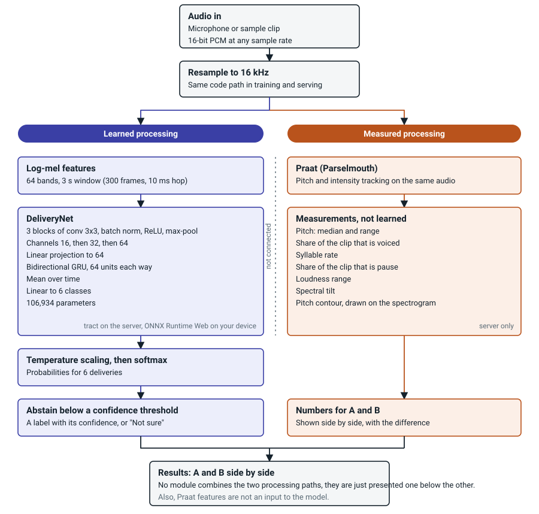

# Beyond the transcript

Play two recordings of the same sentence and see what the audio carries that a transcript drops. A worked
example of delivery (emotion) classification from audio alone: a small PyTorch model, Praat-measured prosody,
an abstain option, live latency numbers, an in-browser (WebAssembly) engine, and a model card.



The model and Praat are two independent readings of the same audio. They are shown side by side and nothing
combines them yet. On the server they run back to back (Praat is not thread-safe, so the server measures one clip at a time).

## If you have five minutes

| Look at | What it shows |
|---|---|
| `btt/features.py` and `app/static/ondevice/features.js` | One audio front end for training and inference, so no train/serve skew. A JavaScript port reproduces it, including the resampler, to under 2e-4 on log-mel. |
| `btt/export.py`, `btt/tract_runtime.py`, `tests/test_model_export.py` | PyTorch to ONNX to [tract](https://github.com/sonos/tract), with a parity test because tract issue #2751 (GRU activation attributes ignored) can fail silently. |
| `btt/evaluate.py` | Speaker-level bootstrap intervals, bounded temperature scaling, expected calibration error, abstention, per-group and per-speaker reports. |
| `btt/train.py`, `notebooks/train_kaggle.ipynb` | Speaker-disjoint splits within each corpus, GPU training in the cloud, cross-corpus runs reported separately. |
| `app/main.py`, `app/store.py` | Audio only in memory, timings only on disk, rate limiting on a daily-salted hash held in memory, storage that falls back instead of failing an analysis, JSON that survives NaN intervals. |
| `app/static/ondevice/` and `docs/ON_DEVICE.md` | The model running in the browser with ONNX Runtime Web, checked against the server in a real headless browser. |
| `/model-card` on the running app | Generated from the metrics files at request time, so the card cannot drift from the numbers. |

## What was checked, and how

| Claim | Test | Bar |
|---|---|---|
| tract and PyTorch agree | `tests/test_model_export.py` | logits within 1e-3 |
| Browser features equal Python features | `tests/test_ondevice_features.py` | log-mel within 1e-3 (measured under 2e-4) at 8, 16, 22.05, 44.1, 48 kHz |
| WebAssembly model equals server model | `tests/test_ondevice_browser.py` | probabilities within 2e-3 in headless Chromium |
| No audio is kept | `tests/test_app.py` | no audio files after a request |
| The log never breaks an analysis | `tests/test_app.py` | database down, still 200 |

## Results

On speakers never seen in training the model names the acted delivery 62.3% of the time, against 16.7% by
chance, and abstains on the clips it is least sure about. Trained on one corpus and tested on the other it is
close to chance, which says it has learned corpus-specific cues as well as delivery. Per-group tables, intervals
and the cross-corpus table are on the model card. The page shows its own misses: a scoreboard marks every sample
clip correct, incorrect or unsure, and plots confidence against outcome.

- Training: PyTorch, small CRNN (3 conv blocks, bidirectional GRU, 106,934 parameters).
- Inference: Python (FastAPI), inference in [tract](https://github.com/sonos/tract) via its Python bindings.
- Data: CREMA-D and RAVDESS only. No family or personal recordings are used anywhere.

## What is real and what is not

`artifacts/` is empty on purpose. Until you train on real data the app shows "No model is loaded".
A model trained with `--synthetic` is a pipeline test: it carries `data_source: "synthetic"` and the page
shows a warning banner. Never deploy one.

## Run it

```bash
pip install -r requirements.txt
# 1. train on Kaggle: notebooks/train_kaggle.ipynb  (download artifacts.tgz, unpack into ./artifacts)
# 2. build sample pairs from held-out speakers
python scripts/make_samples.py --ravdess <dir> --cremad <dir> --demographics <csv> \
       --split artifacts/split.json --out app/static/samples
# 3. diagrams: pipeline.svg needs nothing extra; the per-layer table needs torch
python scripts/pipeline_diagram.py
python scripts/arch_diagram.py --out app/static     # needs torchview and graphviz; writes architecture.json for the layer table
# 4. serve
uvicorn app.main:app --port 8000
```

Tests: `pip install -r requirements-train.txt pytest playwright && pytest`. It trains 3 synthetic epochs, checks PyTorch
and tract agree, exercises the API, and (with Node and a Chromium for Playwright installed) checks the JavaScript features
and the WebAssembly model. Those browser tests skip themselves when Node or Chromium is missing.

## Design decisions

- **One front end.** `btt/features.py` is used for training and inference, so there is no train/serve skew.
- **Speaker-disjoint evaluation.** Splits are by speaker within each corpus. Confidence intervals resample
  speakers, not clips. Cross-corpus results (train on one, test on the other) are reported separately.
- **Calibrated abstention.** Temperature scaling on validation, then a confidence threshold giving about 80% coverage.
- **tract parity test.** tract issue #2751 (GRU activation attributes ignored) means a silent mismatch
  is possible, so export is always followed by a PyTorch-vs-tract comparison.
- **Privacy.** Audio is decoded in memory and dropped. The database stores only timings. Rate limiting keys
  on a daily-salted hash held in memory. No third-party scripts, fonts or analytics.
- **No demographic inference.** The model never predicts or uses speaker attributes. Demographic metadata is used
  only offline, to report accuracy by group, and the page shows those groups with their intervals.
- **Two engines, one contract.** The server (tract) and the browser (ONNX Runtime Web) run the same `model.onnx`.
  The page applies temperature and the abstain threshold in one place for both.
- **Cost is stated, not hidden.** The latency footer turns measured server time into a cost per million analyses
  under stated assumptions.

## Limits

Acted speech, adult speakers, mostly North American English. Labels describe delivery, not inner state,
and must not be used to judge people. The author's own production experience is machine-directed speech,
a different register from conversation. Model weights are non-commercial (RAVDESS CC BY-NC-SA 4.0;
CREMA-D ODbL). Sample clips are redistributed under those licences with attribution in the manifest.

## Deploy

### Render (free tier works)
1. Put this repo on GitHub with `artifacts/` and `app/static/samples/` filled in.
2. On render.com choose New, Web Service, pick the repo, set the language to **Docker**, instance type Free.
3. Set the health check path to `/api/health`. Render supplies `PORT`; the Dockerfile uses it.
4. Free instances sleep after 15 idle minutes and take about a minute to wake, and their disk is ephemeral.
   Switch to the Starter instance (always on, billed by the second) while you are sharing the link.

Hugging Face Docker Spaces also work but currently need a PRO subscription for free CPU hosting.

### Keep the latency counts: Supabase (optional)
Without a database the counts live on the server and reset on restart. To keep them:
1. Create a Supabase project. Open Connect and copy the **transaction pooler** connection string (port 6543).
2. Set it as the `DATABASE_URL` secret on the host (on Render: Environment).
3. Start the app. It creates a `btt` schema and a `runs` table with row-level security on, so
   Supabase's public REST API cannot read or write it. The app connects as the database role, which is
   not affected by row-level security.

The page says which storage is in use. If the database cannot be reached, the app falls back to local
storage and says so; an analysis never fails because of the log. Not yet tested against a live Supabase
project (no credentials were available when this was written).

### Anywhere that runs Python
Run `uvicorn app.main:app --host 0.0.0.0 --port $PORT` with `requirements.txt` installed. Optional env:
`DATABASE_URL`, `BTT_LOCAL_DB` (path of the local fallback file), `BTT_RATE_LIMIT_PER_MIN` (default 30), `BTT_ARTIFACTS`.

## On-device mode

Built with ONNX Runtime Web (about 14 MB, vendored under `app/static/ondevice/ort/`). See `docs/ON_DEVICE.md`.
Not built: tract compiled to WebAssembly (the Rust target could not be installed in the build sandbox),
and Praat on device.

## Not tested

Supabase against a live project (no credentials were available when this was written).

## License

The code in this repository is released under the MIT License (see LICENSE). The vendored ONNX Runtime Web files
under `app/static/ondevice/ort/` are MIT licensed by Microsoft.

The audio samples in `app/static/samples/` and the trained model in `artifacts/` are not covered by that license.
They derive from RAVDESS (Livingstone and Russo 2018, CC BY-NC-SA 4.0) and CREMA-D (Cao et al. 2014, ODbL), so
they carry those terms: non-commercial use only, with attribution, and share-alike.
